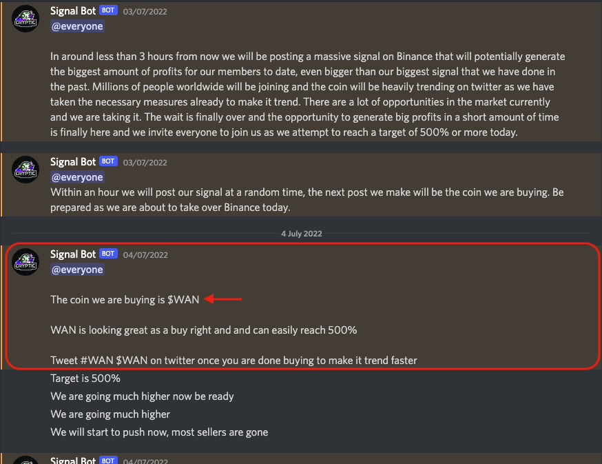

# crypto-pnd-bot

## Background

There have been lots of crypto pump-and-dump (PND) schemes on lesser-known altcoins. A paper written by Jiahua Xu and Benjamin Livshits, [The Anatomy of a Cryptocurrency Pump-and-Dump Scheme](https://arxiv.org/abs/1811.10109) (DOI:10.2139/ssrn.3303365), has a great summary of how they work.

> Set-up: The organizer creates a publicly accessible group or channel, and recruits as many group members or channel
> subscribers as possible by advertising and posting invitation links on major forums such as Bitcointalk, Steemit, and
> Reddit.
>
> Telegram channels only allow subscribers to receive messages from the channel admin, but not post discussions in the
> channel. In a Telegram group, members can by default post messages, but this function is usually disabled by the group
> admin to prohibit members’ interference. We use the terms channel and group interchangeably in this paper.
>
> Pre-pump announcement: The group is ready to pump once it obtains enough members (typically above 1,000). The pump
> organizer, who is now the group or channel admin, announces details of the next pump a few days ahead. The admins broad-
> cast the exact time and date of the announcement of a coin which would then precipitate a pump of that coin. Other in-
> formation disclosed in advance includes the exchange where the pump will take place and the pairing coin. The admins
> advise members to transfer sufficient funds (in the form of the pairing coin) into the named exchange beforehand.
>
> While the named pump time is approaching, the admin sends out countdowns, and repeats the pump “rules” such as: 1) buy
> fast, 2) “shill” the pumped coin on the exchange chat box and social media to attract outsiders, 3) “HODL” the coin at
> least for several minutes to give outsiders time to join in, 4) sell in pieces and not in a single chunk, 5) only sell
> at a profit and never sell below the current price. The admin also gives members a pep talk, quoting historical pump
> profits, to boost members’ confidence and encourage their participation.
>
> Pump: At the pre-arranged pump time, the admin announces the coin, typically in the format of an OCR (optical
> character recognition)-proof image to hinder machine reading. Immediately afterwards, the admin urges
> members to buy and hold the coin in order to inflate the coin price. During the first minute of the pump, the coin price
> surges, sometimes increasing several fold.
>
> Dump: A few minutes (sometimes tens of seconds) after the pump starts, the coin price will reach its peak. While the
> admin might shout “buy buy buy” and “hold hold hold” in the channel, the coin price keeps dropping. As soon as the first
> fall in price appears, pump-and-dump participants start to panic-sell. While the price might be re-boosted by the second
> wave of purchasers who buy the dips (as encouraged by channel admins), chances are the price will rapidly bounce back to
> the start price, sometimes even lower. The coin price declining to the pre-pump proximity also signifies the end of the
> dump, since most investors would rather hold the coin than sell at a loss.
>
> Post-pump review: Within half an hour, after the coin price and trading volume recover to approximately the pre-pump
> levels, the admin posts a review on coin price change, typically including only two price points — start price (or low
> price) and peak price, and touts how much the coin price in-creased by the pump. Information such as trading
> volume and timescale is only selectively revealed: if the volume is high, and the pump-and-dump lasts a long time (
> over 10 minutes, say, would be considered “long”), then those stats will be “proudly” announced; if the volume is low or
> the time between coin announcement and price peak is too short (which is often the case), then the information is
> glossed over. Such posts give newcomers, who can access channel history, the illusion that pump-and-dumps are highly
> profitable.

In summary, PND organizers create and advertise public online text channel/group on platforms such as Discord and
Telegram. They host regular pump-and-dump events in the channel/group. They only reveal the targeted altcoin after 
the start of the event. After the announcement of the targeted altcoin, the price of it spikes to an average of +150%-300%, 
then shortly returns to the original price or even lower.

This program listens to Discord messages such that when it detects an altcoin symbol within the text, it instantly buys the
coin and quickly sells it back after the price has been increased to a predefined percentage (+20% by default.)

## Usage

Create a Discord account, a Binance account with API token and find the target Discord PND channel.

Change the Regex expressions which captures the altcoin symbol at `discord_scraper.py`.

Create a `.env` file with the syntax defined as `.env.sample`.

```
DISCORD_EMAIL=*****
DISCORD_PASSWORD=*****
PND_CHANNEL_URL=https://discord.com/channels/*****/*****
BINANCE_API_KEY=*****
BINANCE_API_SECRET=*****
```

Execute the following command to start listening to the Discord channel.

```shell
python3 src/main.py
```


Once an altcoin symbol has been detected within a new message by the defined Regex expressions, the buy-sell process of the altcoin-BTC pair is initiated immediately.
> 
> Example: `WAN` is detected. Initiate buy-sell process of ticker `WANBTC`.


A BUY order is placed, with price taking account of extreme slippage. Once it is filled, a SELL order will be placed at a price of configurable amount of percentage above the current price (ideally +100%, by default +20%).

## Disclaimer

This project is for informational purposes only. You should not construe any such information or other material as
legal, tax, investment, financial, or other advice. Nothing contained here constitutes a solicitation, recommendation,
endorsement, or offer by me or any third party service provider to buy or sell any securities or other financial
instruments in this or in any other jurisdiction in which such solicitation or offer would be unlawful under the
securities laws of such jurisdiction.

Under no circumstances will I be held responsible or liable in any way for any claims, damages, losses, expenses, costs,
or liabilities whatsoever, including, without limitation, any direct or indirect damages for loss of profits.
